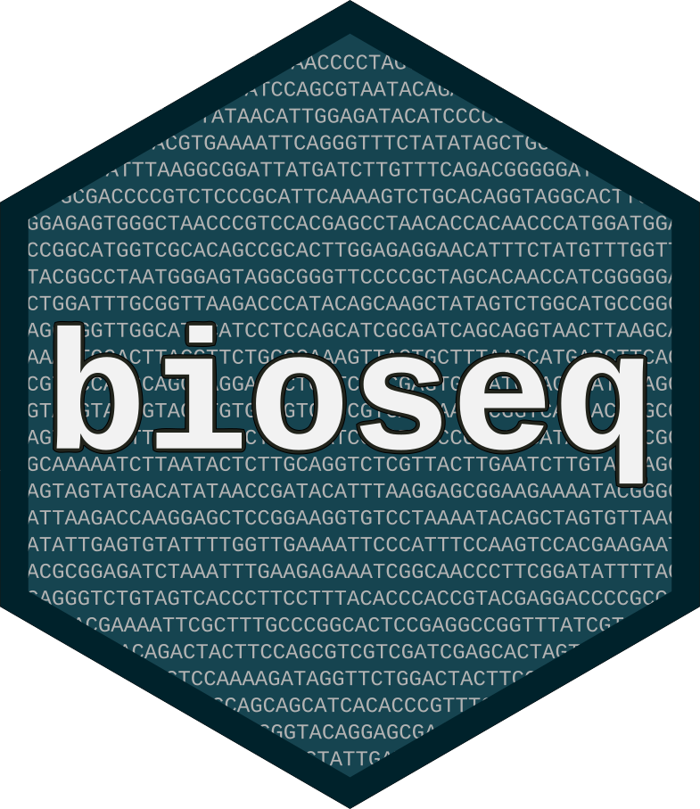

# bioseq: A Toolbox for Manipulating Biological Sequences in R


<!-- badges: start -->
[](https://github.com/fkeck/bioseq/actions)
[](https://codecov.io/gh/fkeck/bioseq?branch=master)
<!-- badges: end -->

The purpose of `bioseq` is to provide a collection of classes and functions for biological sequence manipulation in R. The package provides simple S3 classes for sequences that are suitable for inclusion in a data frame and that can be analysed using the `dplyr` grammar and other `tidyverse` tools.

## Installation

You can install the development version of `bioseq` from GitHub with:

``` r
remotes::install_github("fkeck/bioseq")
```

## Tutorials

There are two vignettes available to get started with the package:

- Introduction to the `bioseq` package
- Cleaning and exploring NCBI data with the `bioseq` package

