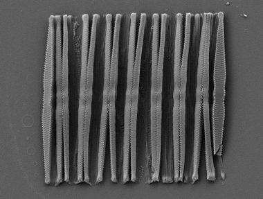

```{r, include = FALSE}
knitr::opts_chunk$set(
  collapse = TRUE,
  comment = "#>",
  fig.width = 6,
  fig.height = 5
)
```

The purpose of this vignette is to illustrate the use of the `bioseq` package with a practical case. For a general introduction to the package please see the vignette *Introduction to the bioseq package*. Here we show how the functions of `bioseq` can be used to clean and explore real biological data. We take as example a set of rbcL sequences of Fragilaria species retrieved from NCBI (these data ared distributed with the package, see `?fragilaria`). Fragilaria is a genus of freshwater and saltwater diatoms. Diatoms are a major group of microscopic algae.

Data obtained from generic repository like NCBI or BOLD often need to be filtered and cleaned before they can be used in a project. Here we show how this can be accomplished using `bioseq` and more particularly how to perform some basic cleaning, extract a specific barcode region from raw sequences, and use functions from other packages. Some of the code chunks presented here can be adapted to reconstruct a phylogeny for a particular taxonomic group or to prepare a reference database against which metabarcoding sequencing reads will be matched for taxonomic identification.



## Loading packages

We start by loading the package `bioseq`. It is assumed that you already intalled the package either from CRAN using the function `install.packages("bioseq)` or from GitHub using `remotes::install_github("fkeck/bioseq")`.

```{r}
library(bioseq)
```

We additionaly load the `tidyverse` package. This is a meta-package which loads several useful packages that we will need for later. In particular we will use `tibble` and `dplyr` to work with tibbles. This allows to work with other types of data and to centralize everything in one place. To learn more about the tidyverse and these packages you can visit.

```{r, eval=FALSE}
library(tidyverse)
```
```{r, include=FALSE}
library(tibble)
library(dplyr)
library(stringr)
```

## Loading data

Genetic data are often delivered in FASTA format. In this example we will use rbcL sequences of Fragilaria species retrieved from NCBI and directly available as unparsed FASTA in the package. We can use the function `read_fasta` to directly read a FASTA file into R. Here we read a vector of character already available in R, but most of the time the argument `file` will be used to pass a path to a file available locally or via the network.

```{r}
data(fragilaria, package = "bioseq")
fra_data <- read_fasta(fragilaria)

fra_data
```

According to the output, we have a DNA vector with `r seq_nseq(fra_data)` sequences. Those sequences were retrieved directly from NCBI. Therefore, they are not aligned and they have different lenght. It is easy to get the range of lengths with the following command:

```{r}
seq_nchar(fra_data) %>% range()
```

As explained in the introduction, we want to analyze the data in a dataframe as it present several advantages. The `bioseq` package has been designed to work smoothly with `tibbles`, an extension of the standard dataframe. Below, we use the `as_tibble` function to turn the DNA vector into a `tibble` with two columns (one for the names and one for the sequences). We will also clean the names and split them into two columns. Finally we create an extra column with the length (number of characters) of each sequence.

```{r}
fra_data <- tibble(label = names(fra_data), sequence = fra_data)
```


```{r}
fra_data <- fra_data %>% 
  mutate(genbank_id = str_extract(label, "([^\\s]+)"),
         taxa = str_extract(label, "(?<= ).*")) %>% 
  select(genbank_id, taxa, sequence)

fra_data <- fra_data %>% 
  mutate(n_base = seq_nchar(sequence))

fra_data
```

### Cropping sequences

In this example we are only interested in a particular region of the sequences, a short fragment used in many diatom metabarcoding studies. To extract the region of interest we can provide two nucleotide position but this solution require the sequences to be aligned. The alternative solution is to crop using nucleotide patterns. Here, we will use the forward and reverse primers delimiting the barcode region to crop the sequences. First, we create two DNA vectors one for the forward and one for the reverse primers:

```{r}
FWD <- dna("AGGTGAAGTAAAAGGTTCWTACTTAAA",
           "AGGTGAAGTTAAAGGTTCWTAYTTAAA",
           "AGGTGAAACTAAAGGTTCWTACTTAAA")

REV <- dna("CAGTWGTWGGTAAATTAGAAGG",
           "CTGTTGTWGGTAAATTAGAAGG")
```

You may have noticed that some characters of the primers are ambiguous which means they can represent several nucleotides. To get all the combinations represented by those ambiguous primer sequences we can use the `seq_disambiguate_IUPAC()` function. For example for the forward primers:

```{r}
seq_disambiguate_IUPAC(FWD)
```

We can see that the three ambiguous sequences used as forward primers actually represent eight different sequences. Fortunately, the functions of `bioseq` can automatically recognize ambiguous nucleotides and interpret them as such. This is why it is always recommended to construct DNA/RNA/AA vectors instead of simple character vector when it is possible.

Now we crop the sequences using the forward and reverse primers as delimiters. We can expect that the returned sequences will be aligned because they correspond to a very specific region with a fixed length.

```{r}
fra_data <- fra_data %>% 
  mutate(barcode = seq_crop_pattern(sequence,
                                    pattern_in = list(FWD),
                                    pattern_out = list(REV)))

fra_data
```

As expected, the barcode sequences seem to be aligned. We can also see that this operation has produced several NAs which correspond to sequences where the primers were not detected, probably because the barcode region was not included in the sequence. We could simply exclude the NA values, but it is safer to filter only the sequences whose length match exactly the expected length of the barcode (i.e. 263 bp).

```{r}
fra_data <- fra_data %>% 
  filter(seq_nchar(barcode) == 263)

fra_data
```

### Consensus sequences and phylogeny

We now want to reconstruct a phylogenetic tree for the sequences. We can include all the sequences in the tree but for clarity we want keep only one sequence per taxa. Instead of selecting one sequence randomly we compute a consensus sequence for each taxa using the function `seq_consensus()`. There are different methods to compute a consensus sequence implemented in the function, you can check the manual for details. The default method used below uses the majority rule.

```{r}
fra_consensus <- fra_data %>% 
  group_by(taxa) %>% 
  summarise(consensus_barcode = seq_consensus(barcode))

fra_consensus
```

Next, we will use `ape` to do a quick phylogenetic reconstruction of these sequences. We can use the function `as_DNAbin` to convert a tibble into a `DNAbin` object and then use the functions of `ape` to reconstruct and plot a phylogenetic tree with the distance-based BIONJ algorithm.

```{r}
fra_consensus %>% 
  as_DNAbin(consensus_barcode, taxa) %>% 
  ape::dist.dna() %>% 
  ape::bionj() %>% 
  plot()
```

### Clustering sequences

The tree above suggests that several sequences are exactly the same. This can be quickly assessed:

```{r}
duplicated(fra_consensus$consensus_barcode)
```

Indeed, several sequences are duplicates and we may want to keep only unique sequences. We could select only unique sequence but here we rather use the `seq_cluster` function to cluster sequences based on their similarity.

```{r}
fra_consensus <- 
  fra_consensus %>% 
  mutate(cluster = seq_cluster(consensus_barcode,
                               threshold = 0.001))
fra_consensus
```

Finally we recompute a consensus sequence for each cluster and we reconstruct the phylogenetic tree.

```{r}
fra_consensus <-
  fra_consensus %>% 
  group_by(cluster) %>% 
  summarise(taxa_group = paste(taxa, collapse = "/"),
            consensus_barcode = seq_consensus(consensus_barcode))

fra_consensus %>% 
  as_DNAbin(consensus_barcode, taxa_group) %>% 
  ape::dist.dna() %>% 
  ape::bionj() %>% 
  plot()
```

It is important to note that this tree is not an accurate phylogenetic reconstruction but it can help to visualise the hierarchical relationships between the sequences. This is particularly useful with larger datasets to detect polyphyletic clades unresolved by the barcode region.

### Exporting data

When we are happy with the results, we usually want to export the data. Here, we could export directly the dataframe using `write_csv()`. However, it might be more convenient to export sequences in FASTA to open them in an other software later. This can be achieved using the function `write_fasta()`.

```{r, eval=FALSE}
fra_consensus %>% 
  select(taxa_group, consensus_barcode) %>% 
  deframe() %>% 
  write_fasta("my_sequences.fasta")
```
